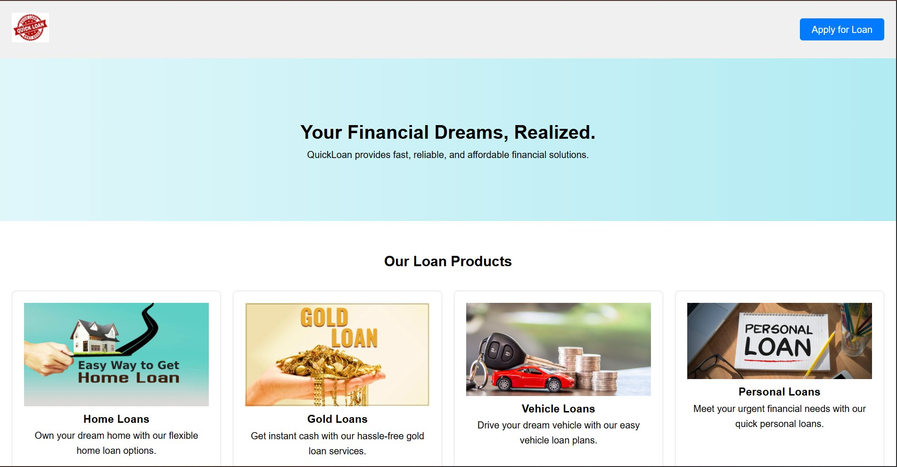
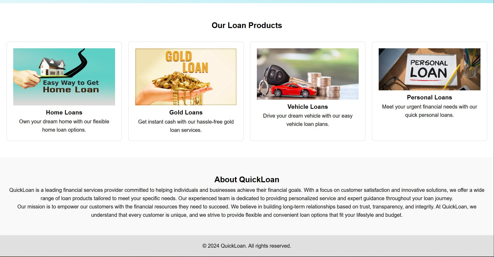
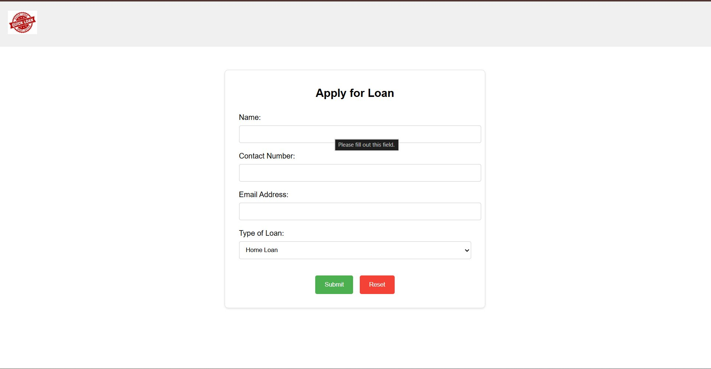
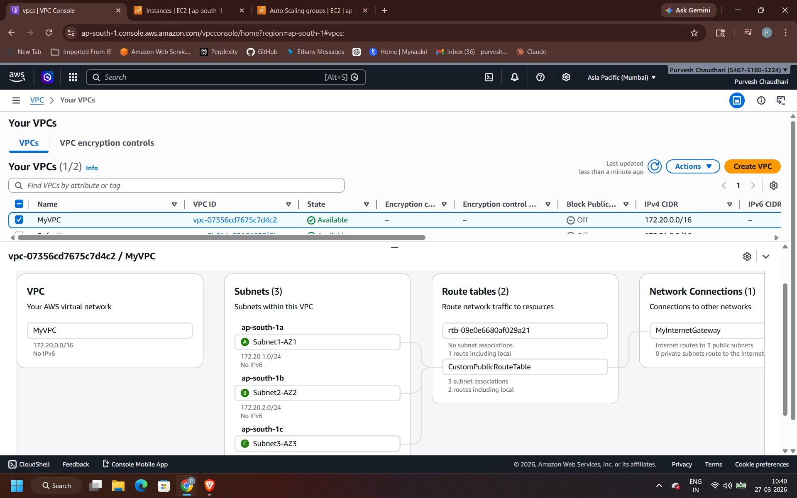
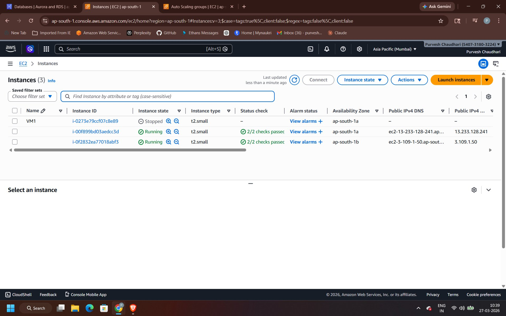
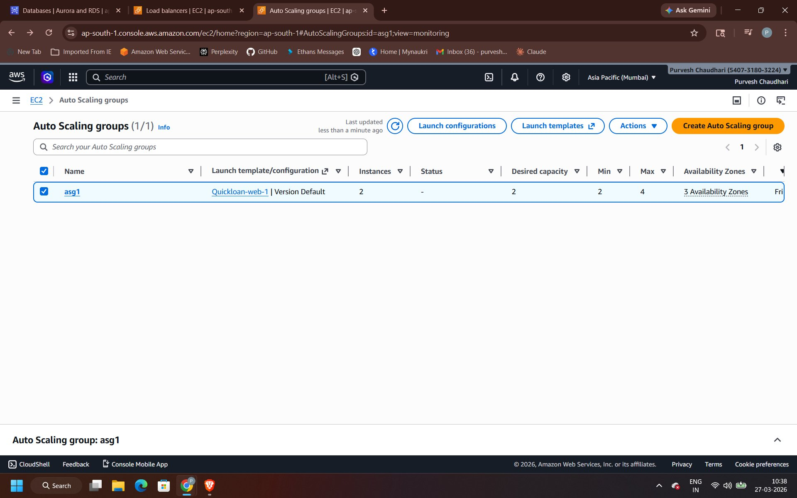
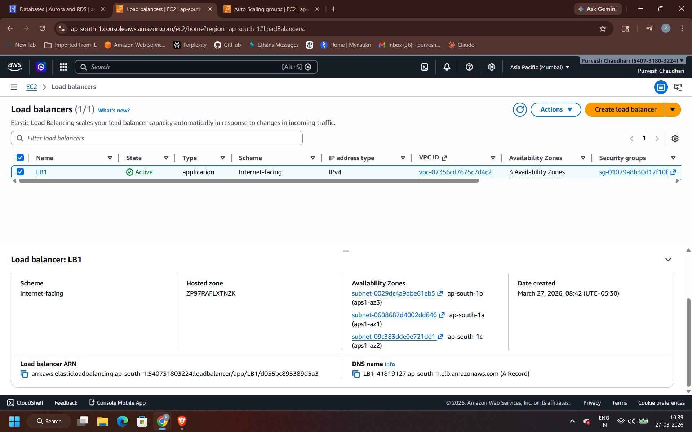
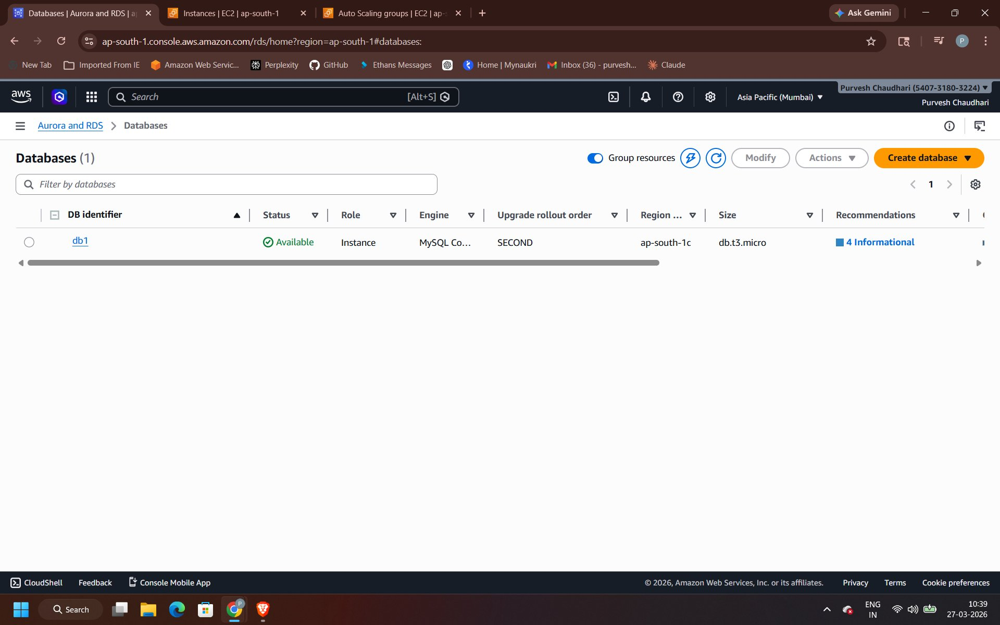
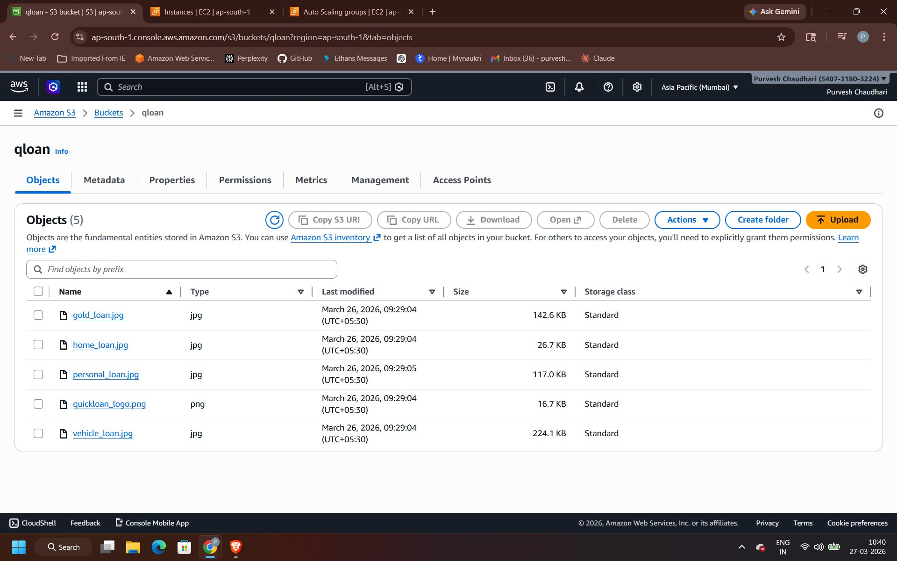
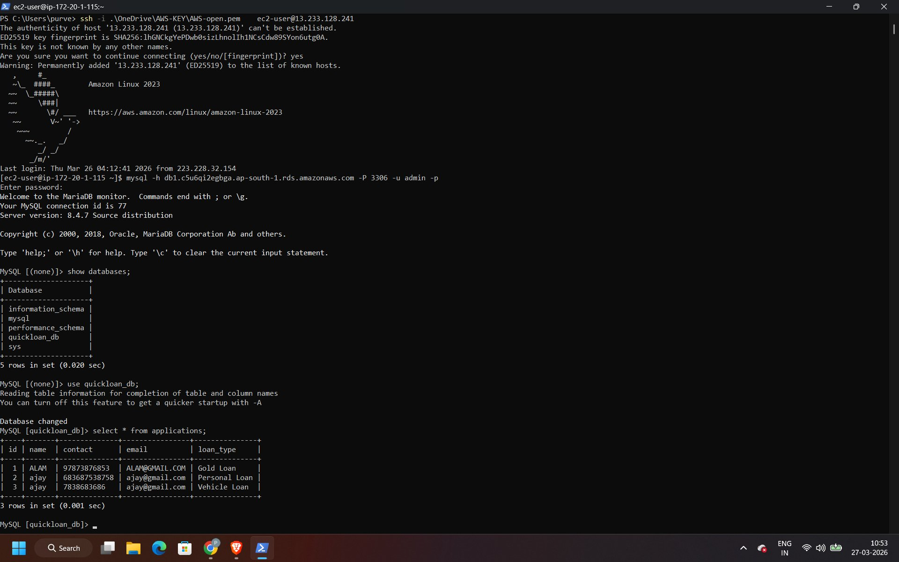

# 🏦 QuickLoan – Scalable Loan Application on AWS

> A PHP-based web application for loan applications, deployed on a fully custom AWS infrastructure with VPC, Auto Scaling, Load Balancing, RDS, and S3.

---

## 📋 Table of Contents

- [Project Overview](#project-overview)
- [Architecture](#architecture)
- [AWS Infrastructure](#aws-infrastructure)
- [Application Stack](#application-stack)
- [Project Structure](#project-structure)
- [Deployment Guide](#deployment-guide)
- [Database Setup](#database-setup)
- [Screenshots](#screenshots)

---

## 📌 Project Overview

**QuickLoan** is a cloud-hosted loan application platform that allows users to apply for Home, Gold, Vehicle, and Personal loans online. The application is built with a PHP backend, HTML/CSS/JS frontend, and backed by a MySQL database on Amazon RDS. Static assets (logo and product images) are served from Amazon S3.

The infrastructure is designed for **high availability**, **scalability**, and **fault tolerance** using AWS managed services.

---

## 🏗️ Architecture

```
                         ┌─────────────────────────────────────────────────┐
                         │                   AWS VPC                        │
                         │           CIDR: 172.20.0.0/16                   │
                         │                                                  │
Internet ──► IGW ──► ALB │                                                  │
                    │    │  ┌──────────┐  ┌──────────┐  ┌──────────┐       │
                    │    │  │ Subnet-1 │  │ Subnet-2 │  │ Subnet-3 │       │
                    └────┼─►│  AZ-1    │  │  AZ-2    │  │  AZ-3    │       │
                         │  └────┬─────┘  └────┬─────┘  └────┬─────┘       │
                         │       │              │              │             │
                         │  ┌────▼──────────────▼─────────────▼──────────┐  │
                         │  │          Auto Scaling Group (asg1)          │  │
                         │  │       EC2 Instances (PHP + Nginx)           │  │
                         │  │   Min: 2  |  Desired: 2  |  Max: 4         │  │
                         │  └──────────────────┬──────────────────────────┘  │
                         │                     │                             │
                         │            ┌────────▼────────┐                   │
                         │            │   Amazon RDS    │                   │
                         │            │  MySQL (db1)    │                   │
                         │            │  db.t3.micro    │                   │
                         │            └─────────────────┘                   │
                         │                                                  │
                         │  ┌─────────────────────────────────────────┐    │
                         │  │         Amazon S3 Bucket (qloan)        │    │
                         │  │  gold_loan.jpg | home_loan.jpg          │    │
                         │  │  vehicle_loan.jpg | personal_loan.jpg   │    │
                         │  │  quickloan_logo.png                     │    │
                         │  └─────────────────────────────────────────┘    │
                         └─────────────────────────────────────────────────┘
```

---

## ☁️ AWS Infrastructure

| Component | Service | Details |
|-----------|---------|---------|
| **VPC** | Amazon VPC | `MyVPC` — CIDR: `172.20.0.0/16`, DNS enabled |
| **Subnets** | EC2 Subnets | 3 Public Subnets: `Subnet1-AZ1` (ap-south-1a), `Subnet2-AZ2` (ap-south-1b), `Subnet3-AZ3` (ap-south-1c) |
| **Route Table** | EC2 Route Table | `CustomPublicRouteTable` — 3 subnet associations, route `0.0.0.0/0 → IGW` |
| **Internet Gateway** | IGW | `MyInternetGateway` — attached to MyVPC |
| **Security Group** | EC2 SG | Inbound: Port 22 (SSH), Port 80 (HTTP) — Outbound: All |
| **EC2 Instances** | Amazon EC2 | `t2.small`, Amazon Linux 2023, Nginx + PHP 8.2 |
| **Auto Scaling** | ASG | `asg1` — Launch Template `Quickloan-web-1`, Min: 2, Desired: 2, Max: 4, 3 AZs |
| **Load Balancer** | ALB | `LB1` — Internet-facing, IPv4, Active, across 3 AZs |
| **Database** | Amazon RDS | `db1` — MySQL 8.0, `db.t3.micro`, ap-south-1c, Status: Available |
| **Storage** | Amazon S3 | `qloan` bucket — 5 objects (product images + logo) |

---

## 🧰 Application Stack

| Layer | Technology |
|-------|-----------|
| **Frontend** | HTML5, CSS3, JavaScript |
| **Backend** | PHP 8.2 |
| **Web Server** | Nginx |
| **Database** | MySQL 8.0 (Amazon RDS) |
| **Infrastructure** | AWS (VPC, EC2, RDS, S3, ALB, ASG) |
| **IaC** | AWS CloudFormation (YAML) |

---

## 📁 Project Structure

```
quickloan/
├── public/
│   ├── index.html              # Homepage with loan products
│   ├── apply.php               # Loan application form
│   ├── submit_application.php  # Form submission handler
│   └── styles.css              # Application styles
├── includes/
│   └── db_connect.php          # Database connection config
├── nginx/
│   └── quickloan.conf          # Nginx virtual host config
├── infra/
│   └── vpc-ec2.yml             # CloudFormation template (VPC + EC2)
├── sql/
│   └── init.sql                # Database and table initialization
├── screenshots/                # Project screenshots
└── README.md
```

---

## 🚀 Deployment Guide

### Prerequisites

- AWS Account with appropriate IAM permissions
- EC2 Key Pair named `AWS`
- AWS CLI configured

### Step 1: Deploy Infrastructure via CloudFormation

```bash
aws cloudformation deploy \
  --template-file infra/vpc-ec2.yml \
  --stack-name quickloan-stack \
  --parameter-overrides InstanceType=t2.small
```

### Step 2: Configure the EC2 Instance

SSH into the instance and run:

```bash
# Set hostname
sudo hostnamectl set-hostname appsrv

# Update and install Nginx
sudo dnf update -y
sudo dnf install nginx -y
sudo systemctl start nginx && sudo systemctl enable nginx

# Install PHP 8.2
sudo dnf install php8.2 php-fpm php-mysqlnd php-pdo php-mbstring -y
sudo systemctl start php-fpm && sudo systemctl enable php-fpm
sudo systemctl restart nginx

# Install MySQL client
sudo yum install mariadb105 -y
```

### Step 3: Deploy Application Files

```bash
# Copy application files to nginx web root
sudo cp -r public/ /usr/share/nginx/html/
sudo cp -r includes/ /usr/share/nginx/html/

# Set permissions
sudo chown -R nginx:nginx /usr/share/nginx/html/public
sudo chmod -R 755 /usr/share/nginx/html/public
```

### Step 4: Configure Nginx

```bash
# Copy the config (update domain name in the file first)
sudo cp /usr/share/nginx/html/nginx/quickloan.conf /etc/nginx/conf.d/
sudo nginx -t
sudo systemctl restart nginx
```

### Step 5: Update Database Connection

Edit `includes/db_connect.php` with your RDS details:

```php
$servername = "<your-rds-endpoint>";
$username   = "<your-db-username>";
$password   = "<your-db-password>";
$dbname     = "quickloan_db";
```

---

## 🗄️ Database Setup

Connect to your RDS instance using the MySQL client and run `sql/init.sql`:

```bash
mysql -h <rds-endpoint> -u admin -p < sql/init.sql
```

This creates the `quickloan_db` database and the `applications` table:

```sql
CREATE DATABASE quickloan_db;
USE quickloan_db;

CREATE TABLE applications (
    id         INT AUTO_INCREMENT PRIMARY KEY,
    name       VARCHAR(255) NOT NULL,
    contact    VARCHAR(20)  NOT NULL,
    email      VARCHAR(255) NOT NULL,
    loan_type  VARCHAR(50)  NOT NULL
);
```

---

## 📸 Screenshots

### 🌐 Web Application

**Homepage – QuickLoan Landing Page**



**Loan Products Section**



**Loan Application Form**



---

### ☁️ AWS Infrastructure

**VPC – MyVPC (172.20.0.0/16) with 3 Subnets, Route Tables & Internet Gateway**



**EC2 Instances – 2 Running (Auto Scaled) + Original VM1**



**Auto Scaling Group – asg1 (Min: 2, Desired: 2, Max: 4 across 3 AZs)**



**Application Load Balancer – LB1 (Internet-facing, Active)**



**RDS Database – db1 (MySQL 8.0, db.t3.micro, Available)**



**S3 Bucket – qloan (Logo + 4 Loan Product Images)**



**Live DB Records – Applications submitted via web form stored in RDS**



---

## 📄 CloudFormation Parameters

| Parameter | Default | Description |
|-----------|---------|-------------|
| `VPCCIDRBlock` | `172.20.0.0/16` | VPC CIDR |
| `Subnet1CIDRBlock` | `172.20.1.0/24` | Subnet 1 (AZ1) |
| `Subnet2CIDRBlock` | `172.20.2.0/24` | Subnet 2 (AZ2) |
| `Subnet3CIDRBlock` | `172.20.3.0/24` | Subnet 3 (AZ3) |
| `InstanceType` | `t2.small` | EC2 instance type |
| `CustomAmiId` | `ami-0f559c3642608c138` | AMI ID for the region |
| `UseSsmAmi` | `false` | Use latest AL2023 AMI via SSM |

---

## 👨‍💻 Author

Built as part of an AWS cloud infrastructure project demonstrating end-to-end deployment of a scalable web application using core AWS services.

---

## 📜 License

This project is for educational/training purposes.
